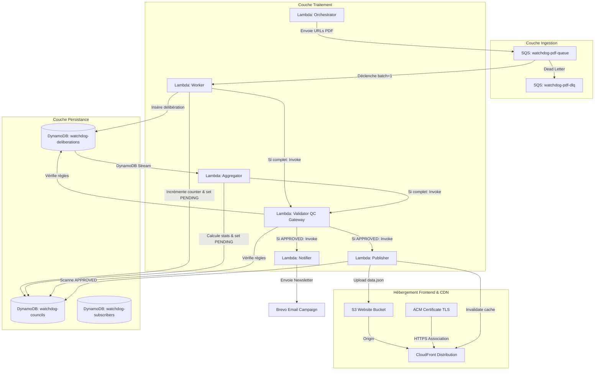

# Technical Handover — WatchdogCity

Ce document d'architecture et de transfert technique synthétise le fonctionnement du projet **WatchdogCity** (Watchdog municipal de la ville de Bègles, déployé sur [lobservatoiredebegles.fr](https://www.lobservatoiredebegles.fr)). Conçu sous forme de guide de soutenance, il détaille les choix d'infrastructure (IaC), d'automatisation (CI/CD), de flux applicatif, d'observabilité et propose une section "Self-Defense" pour l'entretien technique.

---

## 1. Infrastructure as Code (IaC) — Le Socle

L'infrastructure de WatchdogCity est entièrement serverless et provisionnée via **AWS CDK (Cloud Development Kit)** en Python (`cdk/watchdog_stack.py`).



### 1.1 Choix Technologique : AWS CDK vs Terraform / CloudFormation
- **CDK vs Terraform** : 
  - **Gestion des Assets** : WatchdogCity comporte de nombreuses fonctions Lambda écrites en Go. CDK gère nativement le cycle de vie des assets de code (compression zip automatique des dossiers compilés et envoi vers S3 via `lambda.Code.from_asset("../dist/worker.zip")`). Terraform nécessite l'écriture de scripts externes ou de modules complexes pour archiver et uploader le code Go compilé.
  - **Richesse des Construits (L2/L3)** : CDK fournit des abstractions puissantes. Par exemple, la synchronisation et le déploiement du site statique avec invalidation sélective de CloudFront s'effectuent via `s3_deploy.BucketDeployment` en quelques lignes de Python. En Terraform, cela imposerait l'utilisation combinée du provider S3, de scripts AWS CLI et de triggers CloudFront.
  - **Typage et IDE** : Le choix de Python pour le CDK permet d'écrire l'infrastructure comme du code applicatif, bénéficiant de l'autocomplétion, de la validation de type et de la refactorisation.
- **CDK vs CloudFormation** : CloudFormation en YAML/JSON devient rapidement illisible et redondant. CDK compile (synthétise) en CloudFormation standard, combinant la robustesse du moteur d'AWS et l'expressivité d'un langage objet.

### 1.2 Composants Principaux de la Pile (Stack)
1. **Base de Données (DynamoDB)** :
   - `watchdog-councils` (PK: `council_id`) : Stocke l'état d'avancement des conseils, la métadonnée du prochain conseil, et les configurations générées (les paramètres de la newsletter).
   - `watchdog-deliberations` (PK: `id`, GSI: `council_id-index`) : Contient les données extraites de chaque délibération. Équipée d'un DynamoDB Stream (`NEW_IMAGE`) pour déclencher l'agrégation statistique.
   - `watchdog-subscribers` (PK: `email`) : Stocke les abonnés à la newsletter et leur état de confirmation.
   - *Sécurités* : Mode de facturation à la demande (`PAY_PER_REQUEST`), Point-In-Time Recovery (`point_in_time_recovery=True`) activé pour permettre des restaurations à la seconde près, et politique de rétention (`RemovalPolicy.RETAIN`) pour interdire toute suppression de table lors d'un accident de déploiement.
2. **Couche Ingestion & Queue (SQS)** :
   - `watchdog-pdf-queue` : File d'attente tampon avec un temps de visibilité (`visibility_timeout`) calé à 6 minutes pour s'accorder avec la durée limite de traitement des PDF par les Lambdas Workers.
   - `watchdog-pdf-dlq` : Dead Letter Queue configurée pour récupérer les messages échouant plus de 3 fois, avec une période de rétention de 14 jours pour faciliter l'analyse et le rejeu manuel.
3. **Couche Front-End & CDN** :
   - Un **S3 Bucket existant** référencé de manière statique pour éviter toute perte de fichiers lors d'une mise à jour d'infrastructure.
   - Une **Distribution CloudFront** configurée en redirection HTTPS forcée, supportant la compression automatique (Brotli et Gzip).
   - **Déploiement en 3 phases sécurisées (Pipeline de déploiement CDK)** :
     - *Phase 1 (Assets statiques)* : Déploiement des images et polices dans le bucket S3 avec un header Cache-Control agressif (`immutable, max-age=31536000`), sans invalidation CloudFront (les fichiers ont des noms uniques).
     - *Phase 2 (Configuration HTML/JS/CSS)* : Déploiement des pages et scripts du site avec un header `no-cache` et invalidation chirurgicale de CloudFront pour ces fichiers précis.
     - *Phase 3 (Données data.json)* : Déploiement du fichier de données avec header `no-cache` et invalidation CloudFront pour `/data.json`.
     - *Ordonnancement* : Les déploiements sont chaînés via `add_dependency` pour s'assurer que les assets statiques soient déjà présents sur S3 avant que le HTML et le JS ne soient poussés et invalidés.

---

## 2. Pipeline CI/CD & Automatisation

L'ensemble de l'intégration et du déploiement est automatisé via GitHub Actions (`.github/workflows/deploy.yml`).

### 2.1 Description du Workflow après un `git push`
Après chaque push sur la branche `main`, un runner `ubuntu-latest` exécute les étapes suivantes :
1. **Checkout** : Récupération du code source.
2. **Setup Runtimes** :
   - **Go 1.26** avec activation du cache basé sur les fichiers `go.sum` du dossier `lambdas/`.
   - **Node.js 20** avec activation du cache `npm` basé sur `frontend/package-lock.json`.
   - **Python 3.11** avec activation du cache `pip` basé sur `cdk/requirements.txt`.
3. **Installation des Dépendances** :
   - Installation globale du CLI `aws-cdk`.
   - Création du `.venv` Python pour le CDK et installation des bibliothèques requises.
   - Installation propre du frontend via `npm ci`.
4. **Build Frontend** : Exécution de `npm run build` dans le répertoire frontend.
5. **Garde-fou Pré-déploiement (Pre-deploy Guard / Fail-Fast)** :
   Le script vérifie la présence et la non-vacuité des fichiers indispensables du frontend (`index.html`, `app.js`, `style.css`, `merci.html`, `data.json`). Si l'un de ces fichiers est manquant ou vide (suite à un build corrompu), le déploiement échoue immédiatement. Cela évite que le construct de déploiement S3 effectue une synchronisation destructrice qui viderait le bucket et rendrait le site indisponible en production.
6. **Tests Unitaires Applicatifs** : Lancement des tests unitaires de toutes les Lambdas via la commande `make test`.
7. **Compilation et Packaging** : Compilation des Lambdas via la commande `make build`.
8. **Validation du Certificat TLS (Fail-Fast)** :
   Le workflow vérifie que le secret `ACM_CERTIFICATE_ARN` est présent. CDK refusera de déployer sans ce secret, car déployer CloudFront sans certificat détruirait les alias de domaine configurés, renvoyant des erreurs 403 à tous les utilisateurs.
9. **Déploiement AWS** : Exécution de `cdk deploy --all --require-approval never` au sein de l'environnement virtuel Python, en injectant les clés d'accès AWS et les clés d'API requises (Gemini, Brevo).

### 2.2 Stratégie de Build : Cross-Compilation pour ARM64 (Graviton)
Afin de minimiser les coûts d'exécution (les instances ARM64 / Graviton sur AWS Lambda sont environ 20% moins chères et plus performantes que les instances x86_64), nos fonctions Lambdas ciblent l'architecture **ARM64**.

Le runner GitHub Actions s'exécutant sur du x86_64, la cross-compilation native de Go est exploitée dans le `Makefile` :
```bash
GOOS=linux GOARCH=arm64 go build -o bootstrap .
zip -j ../../dist/worker.zip bootstrap
rm bootstrap
```
- `GOOS=linux` : Cible le système d'exploitation du runtime Lambda (`provided.al2023`).
- `GOARCH=arm64` : Cible l'architecture matérielle ARM 64-bits.
- Le binaire compilé doit impérativement s'appeler `bootstrap` (exigence d'AWS pour les runtimes personnalisés).
- L'argument `-j` de `zip` compresse le binaire à la racine de l'archive (sans recréer d'arborescence de dossiers), ce qui est requis par le moteur d'exécution d'AWS Lambda.

---

## 3. Flux de Données & Couche Applicative

Le pipeline de données respecte les principes d'asynchronisme, de découplage et d'idempotence pour assurer la robustesse métier.

### 3.1 Parcours Complet d'un Événement (Scraping → Newsletter)
1. **Déclenchement (Cron Daily)** : EventBridge déclenche la Lambda **Orchestrator** tous les jours de la semaine à 18:00 (Paris).
2. **Ingestion & Découpage** : L'Orchestrator interroge la mairie de Bègles, extrait les métadonnées et la liste des conseils. Pour tout nouveau conseil détecté, il :
   - Crée une entrée dans `watchdog-councils` avec `total_pdfs` et `processed_pdfs = 0`.
   - Divise la charge de travail : il envoie un message SQS individuel par délibération PDF dans la file `watchdog-pdf-queue`.
3. **Extraction IA (Workers)** : Les Lambdas **Workers** consomment les messages SQS (par lot de 1 pour isoler les échecs et gérer finement la concurrence). Le Worker :
   - Télécharge le document PDF depuis le site de la mairie.
   - Transmet le document à l'API **Gemini 2.5 Flash** avec un schéma structuré strict pour extraire le titre vulgarisé, le budget impacté, le type de budget, le sens des votes, le climat de vote, et les impacts écologiques.
   - Enregistre le résultat dans la table `watchdog-deliberations`.
4. **Comptabilisation & Fan-Out** :
   - Pour éviter les doubles comptages dus aux retries, chaque Worker exécute une transaction DynamoDB (`TransactWriteItems`) pour incrémenter `processed_pdfs` sur le conseil et marquer la délibération comme `counted = true` de manière atomique.
   - Le Worker qui traite le dernier PDF (lorsque `processed_pdfs >= total_pdfs`) tente de revendiquer le rôle de validateur en posant un verrou d'état : transition de `qc_status` à `PENDING`. S'il réussit, il invoque la Lambda **Validator** de manière asynchrone.
5. **Agrégation Statistique** :
   - Parallèlement, chaque insertion dans la table des délibérations déclenche la Lambda **Aggregator** via le DynamoDB Stream.
   - Une fois toutes les délibérations insérées, l'Aggregator calcule les métriques globales du conseil (budget consolidé, thématique dominante, climat des votes) de manière 100% déterministe en Go (sans LLM pour éviter tout biais ou hallucination statistique), met à jour le conseil dans DynamoDB, et tente lui aussi d'initier l'étape de validation (`qc_status = PENDING` et appel du **Validator**).
6. **Passage de la QC Gateway (Validator)** :
   - Le **Validator** verrouille le traitement en passant l'état à `VALIDATING`.
   - Il charge le conseil et toutes ses délibérations associées, puis applique des règles de qualité déterministes et statistiques (voir chapitre 4).
   - S'il y a quarantaine (verdict invalide) et que le compteur d'essais est inférieur à la limite, il déclenche un auto-nettoyage (effacement des délibérations corrompues et ré-enfilement des PDF dans SQS pour ré-analyse).
   - Si le conseil est validé, il génère le contenu de la newsletter en mode **Sensory Deprivation** via **Gemini 2.5 Pro**, stocke le JSON final dans le conseil, passe l'état à `APPROVED`, puis invoque les Lambdas **Publisher** et **Notifier**.
7. **Diffusion Web & Email** :
   - Le **Publisher** compile le fichier `data.json` regroupant uniquement les conseils `APPROVED`, l'envoie sur S3 et invalide CloudFront.
   - Le **Notifier** récupère les paramètres de la newsletter pré-générés par le Validator, crée la campagne d'emailing sur **Brevo**, l'envoie à la liste de diffusion et consigne `newsletter_sent_at` dans DynamoDB.

### 3.2 Communication Asynchrone via SQS (Découplage)
L'usage de SQS entre l'Orchestrator et les Workers résout trois problématiques d'architecture :
- **Throttling et limitation du débit** : L'API Gemini impose des quotas de requêtes par minute (RPM). SQS permet de réguler la charge en configurant la concurrence maximale des Lambdas Workers (limitée à 5) pour ne pas saturer l'API.
- **Résilience aux pannes** : Le téléchargement de PDF municipaux volumineux et l'analyse IA sont des opérations sujettes à des timeouts ou à des erreurs de connexion. En cas d'échec, le message retourne dans SQS après expiration du temps de visibilité pour être traité par un autre worker.
- **Asynchronisme complet** : L'Orchestrator s'exécute en moins de 10 secondes et délègue le travail lourd aux Workers en tâche de fond.

### 3.3 Rôle de DynamoDB dans la Persistance et l'Idempotence
Pour garantir qu'aucune action ne soit répétée en cas de panne réseau ou de retries automatiques d'AWS Lambda, les mécanismes suivants sont implémentés :
- **Écriture Conditionnelle des Délibérations** : L'insertion d'une délibération par un Worker utilise l'expression conditionnelle `attribute_not_exists(id)`. Si le message SQS est rejoué, le Worker n'écrase pas les données déjà analysées.
- **Transaction Atomique de Comptage** : Le double comptage est rendu impossible par l'utilisation de `TransactWriteItems`. L'incrément de `processed_pdfs` sur le conseil et l'activation du flag `counted = true` sur la délibération réussissent ou échouent ensemble. Si le flag `counted` est déjà vrai, la transaction échoue sans altérer le compteur du conseil.
- **Verrouillage de Publication (Publisher Lock)** : Pour éviter que deux Lambdas Publishers exécutées en parallèle n'écrivent simultanément dans le fichier unique `data.json` sur S3 (risque de *race condition* et d'incohérence), le Publisher acquiert un verrou dans la table DynamoDB (`metadata#publisher_lock`) avec un TTL et un identifiant unique de requête (`lock_owner`).
- **Idempotence de la Newsletter (Two-Phase Claim)** : Avant d'envoyer la campagne Brevo, le Notifier tente d'écrire `newsletter_pending_at`. Si l'opération réussit, le slot de diffusion est réservé. En fin d'envoi, l'état passe à `newsletter_sent_at`. Si une invocation concurrente ou un retry survient, l'écriture conditionnelle échoue car `newsletter_sent_at` existe déjà, évitant ainsi d'envoyer plusieurs fois le même email aux abonnés.

---

## 4. Observabilité & Monitoring

### 4.1 La Gateway de Validation (Le Contrôle Qualité Métier)
Plutôt que d'utiliser un modèle d'IA pour évaluer la production d'un autre modèle (approche *LLM-as-a-Judge*, coûteuse et sujette à l'indéterminisme), WatchdogCity intègre une **Gateway de Validation** déterministe codée en Go pur (`lambdas/shared/qc.go`). Elle applique 16 règles strictes lors du passage de l'état `PENDING` à `APPROVED` :

#### Règles Déterministes (Invariants Métier)
*Toute violation d'une règle déterministe entraîne la mise en quarantaine immédiate (HIGH).*
- **D1 (Validité des Enums)** : Les tags de sujet, types de budget et impacts climatiques extraits doivent correspondre strictement aux listes canoniques du système.
- **D2 (Cohérence Budgétaire)** : Un type de budget déclaré à `AUCUN` doit obligatoirement présenter un impact financier égal à `0` (et inversement).
- **D3 (Signe Budgétaire)** : Le montant global et les montants détaillés des lignes budgétaires doivent être strictement positifs.
- **D4 (Rapprochement du Détail Budgétaire)** : La somme des montants déclarés dans le tableau de ventilation budgétaire doit être égale au montant global de la délibération (à 1 € de tolérance près).
- **D6/D7 (Cohérence des Votes)** : Si `has_vote` est faux, les compteurs de voix doivent être nuls. Si `has_vote` est vrai, les voix exprimées ne peuvent être négatives ni toutes nulles.
- **D8 (Champs Obligatoires)** : Le titre vulgarisé, le résumé et la décision métier doivent être textuellement renseignés.
- **D9 (Présence des Impacts)** : Le champ d'analyse des impacts ne doit pas être nul ou égal à la chaîne `"null"`.
- **D10 (Fuite de Balises - WARN uniquement)** : Détecte la présence de code HTML, de liens markdown ou de formulations d'appel à l'action ("en savoir plus", "→") générées par l'IA dans les champs textuels.

#### Règles Statistiques (Détection d'Anomalies de Masse)
- **S1 (Conseil Vide - HIGH)** : Bloque la validation si le conseil prétend avoir traité des documents mais ne renvoie aucune délibération.
- **S2 (Apathie Décisionnelle - HIGH)** : Si plus de 65 % des délibérations d'un même conseil concluent à un impact qualifié de "Néant", le conseil est jugé anormal et bloqué.
- **S3 (Drift vs Historique - WARN)** : Calcule le z-score du taux d'impact "Néant" par rapport à la moyenne historique des conseils validés. Si l'écart type dépasse 3.0, une alerte est levée.
- **S4 (Effondrement des Catégories - WARN)** : Alerte si toutes les délibérations d'un conseil de plus de 4 documents sont affectées au même tag thématique (signe d'une paresse de classification de l'IA).
- **S5 (Axe Budgétaire Aberrant - HIGH)** : Bloque le conseil si une délibération dépasse un budget unitaire de 500 000 000 € (détection d'une erreur de décimale ou de parsing de l'IA).
- **S6 (Plausibilité Démocratique - HIGH)** : Bloque si le cumul des votes exprimés (Pour + Contre + Abstention) dépasse 60 (la ville de Bègles comportant moins de 40 élus municipaux).

### 4.2 Le Principe de la "Sensory Deprivation" (Garantie de Neutralité)
Pour garantir la probité du projet et écarter tout risque de biais éditorial ou de prise de position politique de l'IA dans la newsletter, la génération du texte est exécutée sous **privation sensorielle**.
- La fonction `GenerateNewsletterParams` appelée par le Validator reçoit exclusivement la structure épurée `ColdDeliberation`.
- Cette structure ne contient **aucun champ de texte libre** rédigé par le Worker (pas de résumé, pas de détail de décision, pas de motif de désaccord, pas de texte brut issu du PDF). Elle ne contient que des métadonnées froides : titre factuel de la délibération, montant budgétaire en euros, sens des votes et tags d'énumération.
- N'ayant aucun support textuel narratif pour s'inspirer, le modèle Gemini 2.5 Pro ne peut pas inventer d'histoire, de reproches ou de justifications politiques. Il se limite à reformuler et structurer des faits mathématiques et catégoriels.

### 4.3 Gestion des Erreurs et Robustesse (Circuit Breaker & Alerting)
1. **Gemini Circuit Breaker** :
   Pour éviter de consommer inutilement les quotas d'API et de bloquer les files d'attente lors d'une panne généralisée des services Google Gemini, un circuit breaker est stocké dans DynamoDB. Chaque échec d'appel à Gemini incrémente un compteur d'erreurs. Si le seuil est dépassé, le circuit s'ouvre : les Lambdas Workers et Notifiers détectent immédiatement cet état et retournent leurs messages en file d'attente SQS sans tenter d'appeler l'API Gemini. Le circuit se referme automatiquement après une période d'attente et un appel de test réussi.
2. **Auto-Guérison (Self-Healing)** :
   Lorsqu'un conseil est envoyé en quarantaine à cause d'une règle de qualité HIGH (ex: divergence de ventilation budgétaire ou format invalide), le Validator applique une procédure d'auto-guérison si le nombre d'essais (`qc_attempts`) est inférieur à 3 :
   - Il supprime les enregistrements de délibérations défaillantes dans DynamoDB.
   - Il réinitialise le compteur `processed_pdfs` à 0 sur le conseil.
   - Il ré-enfile les messages PDF d'origine dans SQS pour forcer une ré-analyse complète par les Workers.
   - Si l'erreur était due à une mauvaise interprétation ponctuelle du LLM, la ré-analyse avec une température de 0 a de fortes chances de corriger le tir sans intervention humaine.
3. **Alerting Opérationnel** :
   - Si la file d'attente d'échec `watchdog-notifier-dlq` reçoit un message (newsletter en échec persistant), une alerte CloudWatch déclenche une notification par email via un topic SNS vers l'équipe d'exploitation.
   - Si un conseil atteint la limite d'essais (3) et reste en quarantaine, la métrique `QcQuarantined` passe à 1, ce qui déclenche immédiatement une alerte d'exploitation CloudWatch SNS.

---

## 5. Fiabilité, Résilience & Sécurité (Principes Well-Architected)

Le pipeline WatchdogCity a été conçu en respectant scrupuleusement les piliers de **Fiabilité** et de **Sécurité** du framework AWS Well-Architected.

### 5.1 Sécurité (Security)
1. **Principe du Moindre Privilège (IAM)** :
   Chaque Lambda dispose de son propre rôle IAM (`aws_iam.Role`) restreint au strict minimum de ressources et d'actions requises. Par exemple, le `Worker` n'a pas accès à la table `SubscribersTable` ni l'autorisation `ses:SendEmail`. Le `Publisher` ne peut écrire que dans le bucket S3 spécifique et n'a aucun accès en écriture sur DynamoDB à l'exception du mécanisme de verrouillage (`metadata#publisher_lock`).
2. **Chiffrement des Communications (Transit Encryption)** :
   Le site statique et les API exposés via API Gateway imposent l'utilisation de **TLS/HTTPS**. Le trafic HTTP est redirigé à 100% vers HTTPS au niveau de CloudFront. L'appel vers les APIs externes de Google Gemini et Brevo s'effectue exclusivement par des requêtes HTTPS chiffrées.
3. **Protection contre la Destruction de Données** :
   - `RemovalPolicy.RETAIN` : Les tables DynamoDB (`councils`, `deliberations`, `subscribers`) sont marquées pour ne pas être supprimées si le stack CDK est détruit.
   - `point_in_time_recovery=True` (PITR) : Autorise une restauration granulaire de la base à la seconde près en cas de corruption applicative ou d'erreur humaine.
4. **Gestion des Secrets** :
   Les variables sensibles (`GEMINI_API_KEY`, `BREVO_API_KEY`) sont stockées de façon sécurisée dans GitHub Secrets et injectées comme variables d'environnement au runtime de la Lambda par le CDK à la volée, évitant tout commit de secret en clair dans le code.

### 5.2 Fiabilité et Résilience (Reliability)
1. **Garantie d'Idempotence (Zéro doublon)** :
   - **Ingestion** : Le `Worker` écrit ses données avec la condition DynamoDB `attribute_not_exists(id)` pour éviter d'écraser des délibérations en cours d'analyse.
   - **Incrément du compteur** : L'incrémentation de `processed_pdfs` sur le conseil et l'activation du flag `counted = true` sur la délibération sont enveloppées dans une transaction DynamoDB (`TransactWriteItems`). Si la Lambda crashe et SQS rejoue le message, la transaction échoue proprement sans double-compter.
   - **Édition du site** : Le `Publisher` utilise un verrou de verrouillage atomique (`metadata#publisher_lock`) pour sérialiser l'écriture dans `data.json` sur S3 et éviter les collisions d'écritures concurrentes.
   - **Campagne Brevo** : Le `Notifier` utilise un double verrouillage d'état (`newsletter_pending_at` et `newsletter_sent_at`) et dérive une clé d'idempotence stable à partir de l'identité du conseil. Il interroge Brevo pour vérifier si la campagne existe déjà avant de la créer.
2. **Mécanisme de Circuit Breaker (Gemini)** :
   Les Lambdas `Worker` et `Notifier` intègrent un circuit breaker distribué. Si l'API Gemini est en surcharge ou en panne, le système détecte la succession d'erreurs et "ouvre" le circuit. Les messages SQS sont alors immédiatement reportés sans appeler l'API Gemini, protégeant ainsi nos quotas et notre budget contre des boucles infinies de requêtes d'erreur.
3. **Auto-Guérison (Self-Healing)** :
   En cas de validation défectueuse détectée par la QC Gateway (Validator), si `qc_attempts` < 3, le Validator purge automatiquement les délibérations existantes pour ce conseil, remet le compteur `processed_pdfs` à 0, et renvoie toutes les URLs PDF dans la file SQS. Ce processus gère automatiquement les erreurs de parsing transitoires de l'IA sans intervention humaine.
4. **Isolations des Pannes via SQS et DLQ** :
   La file SQS amortit les pointes de charge de scraping. Le paramétrage du `visibility_timeout` (6 min) supérieur à la durée maximale d'une Lambda garantit que les messages ne soient pas libérés trop tôt. En cas d'erreur de traitement persistante (ex: un PDF corrompu impossible à décoder), les messages sont poussés dans la DLQ après 3 tentatives, évitant de bloquer les autres messages de la file.
5. **Déploiement Frontend Multi-Phases** :
   Le CDK déploie les assets frontend dans un ordre strict : statiques immutables d'abord, puis fichiers HTML/JS/CSS avec `no-cache`, et enfin `data.json`. Les dépendances explicites garantissent que le site ne pointe jamais vers un fichier inexistant pendant le processus de déploiement.

---

## 6. Entretien "Self-Defense" — Questions & Réponses Critiques

Cette section prépare aux questions difficiles qu'un architecte ou un recruteur senior pourrait poser lors de la soutenance orale du projet.

#### Q1 : Pourquoi avoir choisi AWS CDK en Python plutôt que Terraform ?
* **Réponse attendue** : « J'ai choisi CDK pour sa capacité à gérer l'intégration étroite entre le code applicatif (les Lambdas en Go) et l'infrastructure. Avec CDK, le packaging, le zippage et le téléversement des binaires Go vers S3 sont gérés de manière transparente via `lambda.Code.from_asset()`. Terraform nécessiterait des scripts bash externes ou des modules tiers complexes pour réaliser cela. De plus, CDK me permet d'écrire mes déploiements frontend complexes (comme le Bucket Deployment multi-phases avec chaînage de dépendances et invalidation sélective de CloudFront) de façon programmatique et lisible, tout en bénéficiant de la puissance du moteur CloudFormation sous-jacent. »

#### Q2 : Comment gères-tu la sécurité et la rotation des secrets (comme les clés d'API Gemini et Brevo) ?
* **Réponse attendue** : « Les secrets ne sont jamais écrits dans le code source ou dans les fichiers de configuration CDK. Ils sont stockés de manière sécurisée dans les GitHub Secrets pour le pipeline de déploiement et injectés en tant que variables d'environnement dans les Lambdas lors du déploiement. Pour une version cible plus sécurisée, je préconise l'utilisation d'**AWS Systems Manager Parameter Store (SecureString)** ou d'**AWS Secrets Manager**. Les Lambdas récupéreraient alors les clés d'API dynamiquement au démarrage en mémoire via l'SDK AWS, ce qui éviterait d'avoir des clés d'API lisibles en clair dans la console des variables d'environnement Lambda et permettrait de planifier une rotation automatique des secrets. »

#### Q3 : Que se passe-t-il si un worker Lambda plante au milieu du traitement d'un PDF ? Le compteur DynamoDB n'est-il pas faussé ?
* **Réponse attendue** : « Non, le compteur de progression n'est pas faussé grâce à une architecture transactionnelle. L'incrémentation du champ `processed_pdfs` sur la table des conseils et le passage à `counted = true` sur la délibération sont exécutés au sein de la même transaction DynamoDB (`TransactWriteItems`). Si la Lambda plante avant cette transaction (par exemple pendant le téléchargement ou l'appel Gemini), le message SQS expire dans la file d'attente et est rejoué. Lors du rejeu, la délibération est ré-analysée. Si la transaction avait déjà réussi lors d'une tentative précédente mais que la Lambda a crashé juste après, la condition `attribute_not_exists(counted)` fait échouer la nouvelle transaction de manière propre, garantissant qu'on ne double-compte jamais une délibération. »

#### Q4 : Si tout casse en production (le site renvoie des 403, les emails ne partent plus), quel est ton premier réflexe ?
* **Réponse attendue** : « Mon premier réflexe est de consulter notre tableau de bord **CloudWatch Dashboard (Watchdog-Begles-Health)**. Il regroupe les métriques clés de santé : les erreurs par fonction Lambda, le volume de messages en attente dans la file SQS, et l'état des Dead Letter Queues (DLQ).
  1. Si le site renvoie des 403, c'est généralement un problème au niveau de CloudFront ou du certificat ACM (ex: certificat expiré ou ARN invalide qui a fait sauter les alias de domaine). Je vérifie le statut du certificat dans la console ACM.
  2. Si les emails ne partent plus, je regarde la DLQ de notification. Si elle contient des messages, je lis les logs CloudWatch associés pour identifier l'erreur (ex. expiration de la clé API Brevo, ou quota Brevo dépassé).
  3. Je vérifie aussi la métrique du circuit breaker Gemini pour m'assurer que le pipeline ne s'est pas mis en pause automatique suite à une panne de l'API de Google. »

#### Q5 : Pourquoi avoir centralisé la génération de la newsletter dans le Validator plutôt que de la laisser dans le Notifier ?
* **Réponse attendue** : « Il y a deux raisons fondamentales à ce choix :
  1. **La cohérence de l'état** : En centralisant la génération dans le Validator, les paramètres de la newsletter sont calculés une seule fois pour toutes, validés, et sauvegardés directement dans le document du conseil au sein de DynamoDB (`newsletter_params_json`). Le Notifier devient une fonction "pure", sans état et sans intelligence artificielle : son seul rôle est de lire ces paramètres et de les envoyer à Brevo.
  2. **La résilience aux retries** : Si l'envoi vers Brevo échoue (panne réseau temporaire), le Notifier va être rejoué par AWS Lambda. S'il devait appeler Gemini à chaque rejeu, nous risquerions d'envoyer un contenu légèrement différent à chaque tentative en raison de la nature générative de l'IA (même avec une température à 0). Sauvegarder la newsletter validée en amont garantit que l'email envoyé est exactement celui qui a passé les contrôles de qualité. »

#### Q6 : Qu'est-ce que la Gateway de Validation et pourquoi n'utilises-tu pas un LLM pour juger les résultats (LLM-as-a-Judge) ?
* **Réponse attendue** : « La Gateway de Validation est une barrière de qualité logicielle codée de manière déterministe en Go. Elle applique des assertions strictes (comme la ventilation budgétaire, la cohérence des votes et les limites physiques de sièges du conseil municipal). Je refuse d'utiliser un modèle d'IA pour évaluer la production d'une autre IA (*LLM-as-a-Judge*) car cela introduirait de l'indéterminisme (le verdict pourrait changer d'un appel à l'autre), de la latence supplémentaire, des coûts d'API accrus et un risque d'hallucination secondaire (le juge qui valide une erreur). Notre approche déterministe garantit un comportement prévisible, auditable et permet de mettre en quarantaine de façon certaine toute anomalie de données. »

#### Q7 : Explique le principe de "Sensory Deprivation" appliqué à la génération du contenu.
* **Réponse attendue** : « La privation sensorielle est notre garantie absolue de neutralité politique. L'IA chargée de rédiger la newsletter ne reçoit jamais le texte des résumés ou des décisions rédigés par les workers, ni le texte brut des PDF originaux. Elle reçoit uniquement un dictionnaire de données structurées et factuelles (`ColdDeliberation`) : le titre factuel de la délibération, la catégorie, le montant en euros et le décompte des votes. N'ayant accès à aucun récit ou commentaire politique d'origine, le modèle est structurellement incapable d'insérer des jugements de valeur, d'interpréter des intentions ou d'introduire des biais éditoriaux. Il ne fait que formuler des faits froids et quantifiables. »
